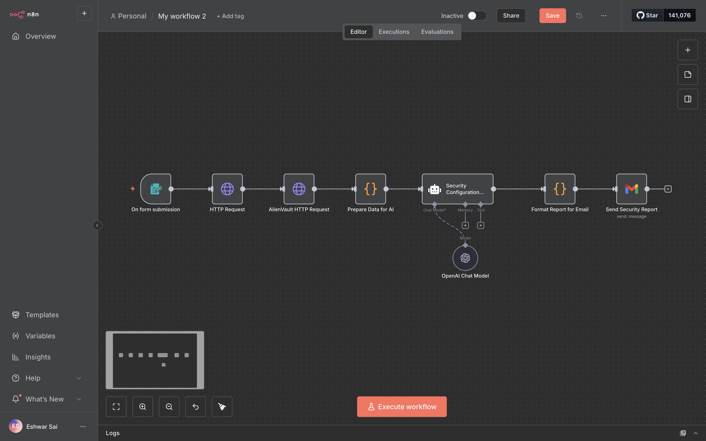

# 🔐 Website Security Audit Workflow (n8n)

This repository contains an **n8n workflow** that automates website security audits by combining:

- 🌐 Direct website scanning  
- 🛰️ Threat intelligence from **AlienVault OTX**  
- 🤖 Advanced security analysis from **OpenAI LLM**  
- 📧 Automated **email reporting** via Gmail  

---
## Architecture

## 🚀 Workflow Overview

### 🔄 Flow
1. **Input**  
   - User submits a website URL via a simple web form.

2. **Data Collection**  
   - `HTTP Request`: Collects status codes & headers from the target website.  
   - `AlienVault OTX`: Queries known threats and vulnerabilities tied to the website’s hostname.  

3. **Data Preparation**  
   - A custom **Code Node** merges collected data.  
   - Runs initial checks for:  
     - Missing security headers  
     - Error codes  
     - AlienVault warnings  

4. **AI Analysis (Security Audit)**  
   - Sends prepared data to **OpenAI Chat Model**.  
   - AI acts as a cybersecurity expert:  
     - Identifies vulnerabilities  
     - Explains risk & exploitation methods  
     - Suggests mitigation strategies  

5. **Report Formatting**  
   - Another **Code Node** converts AI’s plain text into a structured **HTML report** for email.  

6. **Report Delivery**  
   - Gmail node sends the final HTML security report to the specified recipient.  

---

## ⚙️ Setup Guide

### 1️⃣ Prerequisites
- An **n8n instance** (self-hosted or cloud)  
- OpenAI API key  
- AlienVault OTX API key  
- Gmail account (OAuth2 credentials recommended)  

### 2️⃣ Configure Credentials
- **OpenAI** → Add under `OpenAI API` in n8n  
- **AlienVault OTX** → Add under `AlienVault OTX API`  
- **Gmail OAuth2** → Configure via Google Cloud for secure email sending  

### 3️⃣ Import Workflow
1. Copy the JSON workflow file.  
2. In n8n, go to **Workflows > New > Import from JSON**.  
3. Paste and import the workflow.  

### 4️⃣ Setup Recipient
- In the **Send Security Report** node, update the recipient email address.  

### 5️⃣ Activate
- Enable the workflow.  
- Access the webhook URL (from the "On form submission" node) to start submitting websites for audits.  

---

## 📊 Example Report (Email Output)
The generated email includes:  
- ✅ Status code & header check  
- 🚨 Threat intelligence findings (AlienVault OTX)  
- 🔍 AI-driven vulnerability analysis  
- 🛠️ Suggested mitigations  

---

## 🔒 Security Notes
- Use a dedicated Gmail account or service email for sending reports.  
- Keep your **API keys** secure—store them in n8n credentials, never in plain text.  
- Review OpenAI outputs before sharing externally (as AI may produce false positives/negatives).  

---

## 📜 License
MIT License – feel free to use, modify, and share.  

---

## 🙌 Contributions
Pull requests are welcome! If you’d like to add features (e.g., more threat intel sources, report templates, or integrations), please open an issue first.  

